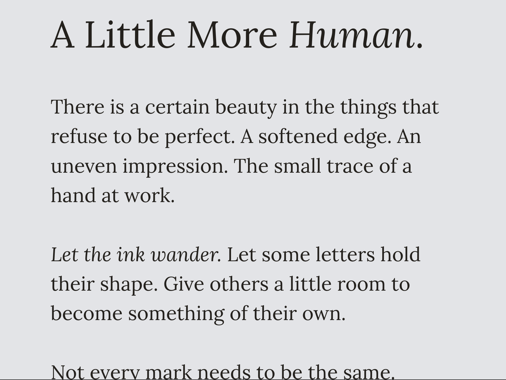
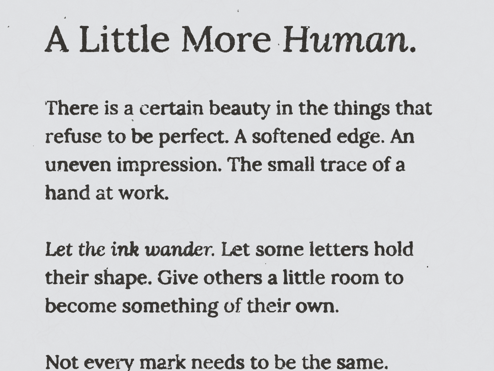

# Impression

**A little more human.**

Impression turns clean digital type into something that looks printed: ink that spreads, edges that soften, and small imperfections that give each letter character. Write on the left, see the printed result on the right, and adjust the effects without losing sight of your last finished print.

Built for serif typography, with rich text editing, selective ink treatments, repeatable randomness, draggable geometric graphics, and PNG export. All text and image processing stays in your browser.

## Before and after

The same text, before and after its print treatment:

| Before | After |
| --- | --- |
|  |  |

## What you can make

- Soft ink spread or a heavily worn impression, with separate controls for texture, fading, and missing ink.
- A library of 18 graphics: scientific diagrams, mathematical curves, and six historical animal engravings. Text wraps around them as you move them.
- Different treatments for selected words, including letters kept completely clean.
- Book-like and fibrous print textures, rough or rounded edges, and subtle page distortion.
- Prints on five paper colors, or ink on a transparent background for use in other designs. The transparent option is the fourth swatch, marked with an X; its preview sits on white.
- Repeatable results from a saved seed, plus **New impression** when you want another variation.

Vite, TypeScript, Quill, and Pretext power the studio. The print engine runs in a browser worker.

## Run locally

```sh
npm ci
npm run dev
```

Open the local URL printed by Vite. `npm run build` creates the static app in `dist/`. `npm test` checks deterministic ink placement and the spread limit.

## Use

- Write and format text in the **Write** tab. Choose EB Garamond, Libre Baskerville, Playfair Display, Bodoni Moda, Cormorant Garamond, Crimson Pro, Lora, or Georgia. The bundled families include regular, italic, bold, and bold italic.
- Open **Effects** to adjust **Ink spread** and **Unevenness** for the document. The full-height sidebar scrolls independently. The paper sits on a dot-grid canvas to the right, with comparison, zoom, and export in a floating toolbar.
- Open **Graphics** and browse **Science**, **Math**, or **Animals**. Science includes orbits, a celestial sphere, lens rays, magnetic field lines, and a pendulum. Math includes Lissajous curves, logarithmic spirals, sine waves, bell curves, waves, and rosettes. Animals includes an elephant, antelope, demoiselle crane, jackal, Nicobar pigeon, and lobster. Drag a graphic on the paper to place it. Text reflows while you drag. A lighter printed proof updates during movement, then the full-resolution print replaces it after release. All ink effects remain enabled throughout; processing never flashes plain text. Press Escape to cancel a drag. Adjust Size and Text gap for every graphic. Diagrams also have Detail and Line weight controls; engravings retain their original linework. Each engraving links to its archive source. Arrow keys move a focused graphic; Shift moves it farther. Duplicate or remove graphics from the same panel. A document can contain up to eight graphics.
- Select letters or words in the editor to give them their own ink settings. **Keep clean** preserves their original outlines. **Reset ink** returns them to the document settings.
- **New impression** changes ink placement while preserving custom selections. **Original** compares against the clean type.
- Printed is the only rendering process. In **Effects**, choose a starting look: **Custom print**, **Book print**, or **Rough paper**. Book print and Rough paper run ocrodeg's complete original print presets; their built-in textures stay part of the starting look.
- **Ink & paper** controls dark ink texture, fading, missing ink, stray specks, and paper grain. Fading and wear are independent of ink texture. In Custom print, choose Paper fibers or Fine grain.
- **Letter edges** controls rough, rounded, broken, and soft outlines.
- **Page shape** controls wavy lines, crooked placement, tilt, width, size, position, and quarter turns. Page movement carries clean selections and their preview highlights along with the lettering.
- **Reset effects** returns the chosen starting look to its defaults, preserving text, formatting, spread, and selection overrides.
- Choose Warm, White, Oat, No paper, Bright white, or Cool gray. No paper removes the paper layer and exports transparency; the preview uses white behind it. Paper settings are kept when you switch back to a paper color. Paper colors stay at the bottom of the control panel. Change spacing and alignment in Write. Export the current proof as a PNG at up to 2× resolution.
- The preview opens at **Fit page** to show the entire sheet. **Fit width** enlarges it for inspecting ink; **100%** shows actual size. Use the plus/minus buttons for 15–300% zoom, or click the percentage to return to 100%. Use the toolbar’s Hide editor button for more room.
- On narrow screens the preview stays above the Write/Effects/Graphics panel. Tabs support arrow-key navigation, and selections survive switching panels.
- The document saves in this browser on this device. There is no cloud document sync. Clearing browser storage removes the saved document.

## Rendering

The renderer preserves shaped text runs, then overlays localized SVG ink diffusion. A seeded, mean-reverting random walk controls coverage across letters. At maximum unevenness, automatic bleed coverage varies continuously from 30% to 100%; lower unevenness brings letters closer to the same coverage. Only an explicit clean selection or zero spread removes bleed. Spread stays bounded by the slider value; random placement does not amplify the filter kernel. Texture seeds are fixed, while rerolling only changes placement.

Selection overrides live inside Quill's Delta as an inline `ink` attribute, so Quill maintains their position through edits and undo/redo. The clean text remains underneath the ink; soft alpha masks avoid hard clipping of letter edges.

Graphics are deterministic SVG curves or locally bundled historical engravings inside the same source ink layer as the text. Fine engraving strokes use reduced ink spread to preserve their crosshatching. Engravings lose their scanned paper through an SVG alpha filter and are embedded into the proof before printing or exporting. Their corners stay inside the wrap circle, preserving clearance around the entire image. See [graphics sources](docs/graphics-sources.md) for asset provenance and rights. The layout subtracts their circular contours from each text row, allowing text on either side of a graphic placed inside a paragraph. Pretext prepares and caches rich-text font measurements, then lays out each available interval as graphics move. Formatting and source selection offsets stay attached to the original Quill glyphs. A measurement-only whitespace adapter preserves repeated spaces; tabs use four spaces. Font loading invalidates measurement caches. Graphics receive document ink diffusion and every print effect; selection-specific overrides still apply only to text. Their positions and settings save with the document. Drag targets follow the geometric transformation of the print, including page turns and waves. Selection frames never appear in exports.

The PNG export embeds the selected bundled font before rasterizing. Georgia uses the system's installed serif font. The initial proof is 720 × 900 units and grows vertically with the text. Ink editing and export run in the browser. Latin font subsets are bundled; other scripts use the browser's serif fallback. This first version uses left-to-right line layout.

## Sources

- [Pretext](https://github.com/chenglou/pretext) — cached text measurement and rich-inline line layout
- [Quill documentation](https://quilljs.com/docs/quickstart)
- [Quill API](https://quilljs.com/docs/api)
- [SVG filter effects](https://www.w3.org/TR/filter-effects-1/)
- [Fontsource](https://fontsource.org/) — locally bundled open-source serif typefaces

The bundled fonts retain their upstream licenses in their packages and in `public/font-licenses/`. Quill uses the BSD-3-Clause license.

## Browser print engine

The print renderer executes the actual [NVlabs/ocrodeg](https://github.com/NVlabs/ocrodeg) Python module inside [Pyodide](https://pyodide.org/en/stable/) in a module Web Worker. No GPU or server processing is required. First use downloads the pinned runtime, NumPy, SciPy, and upstream source; an internet connection is needed for that load. Text and image pixels stay in the browser.

The worker connects the complete `printlike_multiscale` and `printlike_fibrous` helpers using their original default arguments. Custom print separately composes the upstream primitives with the existing shaped text mask. On colored paper, Book print and Rough paper match the upstream grayscale output before paper-color tinting, protection of explicit clean selections, and any extra effects the user enables. Transparent output composes upstream blotch and ink-texture primitives without a paper layer, preserving soft alpha edges and clean selections. These presets already contain texture and blotches; use Custom print to control those individually.

| Visible setting | Implementation |
| --- | --- |
| Book print / Rough paper | `printlike_multiscale` / `printlike_fibrous`, original defaults |
| Ink texture / Paper grain | `make_multiscale_noise`, `make_multiscale_noise_uniform`, `make_fibrous_image` |
| Faded ink | Independent blend of ink toward the selected paper color |
| Missing ink / Stray ink | `random_blobs`, separately erasing / adding ink; full presets also use `random_blotches` |
| Rough edges | `bounded_gaussian_noise` + `distort_with_noise` |
| Rounded edges / Broken edges | `binary_blur`, with independent blur-radius and noise controls |
| Soft edges | SciPy Gaussian blur, as in the upstream examples |
| Wavy lines | `noise_distort1d` + `distort_with_noise` |
| Crooked impression | Seeded `random_transform` + `transform_image` |
| Tilt / Letter width / Size / Position | Explicit `transform_image` parameters |
| Turn text | Quarter-turn rotation, fitted to the existing page |

Custom texture keeps most ink dark. Missing ink has a strong visible maximum and does not depend on the texture slider. Each effect has its own deterministic random stream, so adjusting one effect does not reshuffle unrelated fields. A small `pylab` compatibility module maps the two NumPy random functions ocrodeg uses, avoiding a plotting-library download.

Clean selections preserve their glyph mask and solid ink after page movement. Paper texture continues behind them, including the library presets. Selection highlights follow page movement and are excluded from export. Renders use seeded Python and NumPy generators. Editing stays responsive, and pending changes are coalesced so a stale print cannot replace a newer document. While changes render, the last completed print stays visible at its original proportions and is replaced only when the newest result is ready. Errors retain that last print and show a Retry action; the SVG proof is used only when no print has completed yet. The current successful printed bitmap is also the PNG export, excluding editor selection highlights.

During a pointer drag, printed previews use up to 0.65× resolution and coalesce pending positions. Completed previews from that same drag may be displayed while a newer position is processing. Release or cancellation requests the final full-resolution render, and PNG export waits for that final result. This keeps the actual ocrodeg effects during movement; preview timing depends on the device, document length, and chosen effects.

Finished printed proofs render at up to 2× resolution, capped at three million pixels and 8,192 pixels in height to bound browser memory. Long documents can therefore export at a lower scale. Preview and exported PNG use the same bitmap.

Pinned dependencies:

- Pyodide `314.0.7`, loaded from its documented jsDelivr distribution.
- ocrodeg commit `21109cb4ea0ff90306658e904a3a7b36c1e4f6b7`, loaded directly from the upstream source repository at first use.
- Source integrity: SHA-256 `8599b658a9c92e82eee47460766f937210e7e04edb68088a0bcef95bd644f71d`.

Upstream credit: ocrodeg by Thomas Breuel / NVIDIA. The upstream source is not bundled into this repository.


## Verification

Graphic export checks run at `/tests/graphics.html` while the development server is running. They check all bundled engravings, transparent scan paper, print masks, mixed artwork, print effects, and PNG transparency.

`npm test` covers seeded ink, saved-setting compatibility, control limits, preset resets, output dimensions, graphic persistence, overlapping graphic contours. Open `/tests/pretext.html` on the Vite development server for real-font browser checks of Pretext wrapping, spaces, tabs, Unicode graphemes, mixed styles, cache reuse, actual SVG line widths, transparent interactive printing, and transformed selections. `npm run build` type-checks and builds the browser worker.

`tests/test_print_pipeline.py` checks every effect, visible maximum wear, dark texture versus fading, exact upstream preset output, deterministic seeds, clean selections, transformed selection overlays, offset directions, graphic drag targets after page transformations, empty input, transparent backgrounds, soft alpha edges, and compositing over white. It needs Python with NumPy and SciPy and the pinned upstream `degrade.py` saved as `ocrodeg.py` in a separate directory:

```sh
OCRODEG_SOURCE_DIR=/path/to/pinned-ocrodeg python3 tests/test_print_pipeline.py
```

The upstream source remains external to this repository. Use the commit and integrity hash listed above. Browser checks cover WebAssembly execution, visible controls, selection editing, PNG export, and the Original comparison.

The font menu and PNG font embedding share one font catalog. New bundled serif families come from [Fontsource](https://fontsource.org/), and the same local font files are used for the editor, proof, and export.

## License

Copyright © 2026 Dimitri Michel. See [LICENSE](LICENSE).

This source is available for **personal, noncommercial use**. You may run and privately modify your own copy. Commercial use, redistribution, and offering it as a service require written permission. GitHub's platform rights still apply to viewing and forking this public repository. This is not an open-source license.

Bundled fonts and third-party dependencies keep their own licenses. See [THIRD_PARTY_NOTICES.md](THIRD_PARTY_NOTICES.md). The license does not claim ownership of text or artwork you create with the app.
